> [!NOTE]
> As you noticed, you now opened a "Publication" in the *Editor*. Most
> of the time instead you'll open "topics" here to write the actual
> content, such as instructions, descriptions, etc.
>
> (Usually, the only time you need to open a publication in the Editor
> is to add publication metadata, and e.g the front cover image.)
>
> Now try going back to the Content Manager and open this publication in
> the Structure View instead!
>
> PS: This note normally shouldn't even be here in a publication in line
> with what we said above, of course. But we made an exception just to
> let you know :-)

# Create Your First Topic

The topic is the main building block of the publications you create. You
can think of a topic of like a small section with a heading in a
traditional document. It usually just has one title, just like a
document section would.

The nesting of the topics on different levels in your Publication is
what creates the heading levels as you'll see.

This topic will describe some of the steps for you to start creating
your own. But feel free to play around with this one too.

> [!TIP]
> You can always get a quick preview of what your output would look like
> when publishing to PDF or HTML in the Preview tab. Later when you have
> created your own layouts you can also use that layout for the preview.
>
> (This is not the same as publishing your final output, which you would
> normally do for an entire publication, not just an individual topic.)

1.  Create a new topic. You can do this in two ways:

    Either click the Create content button at the top of the Content
    Manager, and select Topic.

    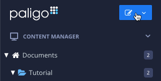

    Or click Create content in the context menu next to a folder:

    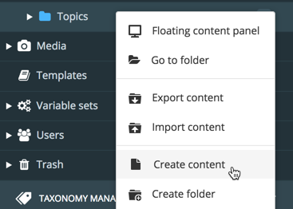

2.  Give the topic a name in the dialog, and then click Ok.

3.  Ctrl-click (or Cmd-click on a Mac) on the new topic in the Content
    Manager to open the topic in a new browser tab. That way you can
    have it open to try things out in it, while moving on with the
    tutorial topics.

Great. Now, if you want, you can work through some of the other tutorial
topics!

# Create Your First Publication

**The publication is where you drag and drop your topics to (re)use them
and structure your full document.**

1.  Creating a Publication resource is similar to creating a topic, but
    just select Publication instead of Topic:

    Either click the Create content button at the top of the Content
    Manager, and select Publication.

    

    Or click Create content in the context menu next to a folder:

    

2.  Give the Publication a name in the dialog, and then click Ok.

3.  Next, instead of opening the Publication in the editor, open it in
    the Structure View:

    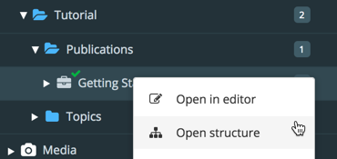

4.  The Structure View opens. Now just drag and drop to nest topics,
    either new ones or restructuring existing ones added before. Just
    like building a *Table of Contents*:

> [!NOTE]
> You'll notice that you see the topics nested under the Publication if
> you unfold it in the Content Manager. But these are just references,
> or as we call them in Paligo, forks. 
>
> 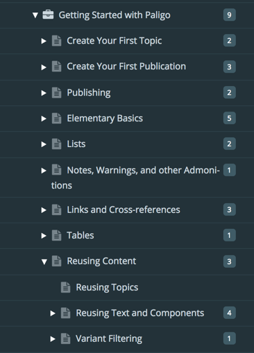
>
> The actual topics are located in the Topics folder:
>
> 
>
> By the way, you do not have to use the folder structure in the sample.
> You can create any folders you like and organize your topics and
> publications as you please. The best folder structure is the one that
> helps you navigate through your content as an author.

# Publishing

Well, this is what you're here for in the end, right? No matter how many
smart reuse and structured authoring techniques you are going to learn,
you want to publish the content.

So let's try that right now so you'll see what you can do once you've
finished authoring!

1.  Click the context menu next to the publication "Getting Started with
    Paligo".

2.  Select Publish.

    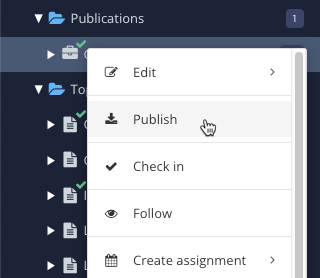

3.  Select format, e.g HTML5.

    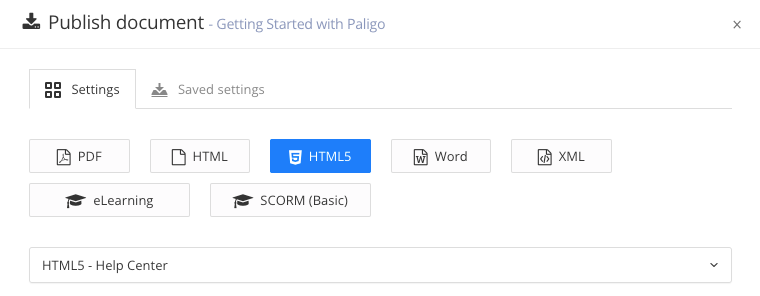

    For now, never mind the other options, you can learn more about
    those later!

4.  Click Publish document.

5.  Do the same for PDF, just to try it out.

6.  By default you'll get the output result downloaded as a zip file.
    You can also select to save the results in Paligo using the checkbox
    for that.

- There are more output formats available, such as presentation slides,
  ePub, javahelp, etc. The ones included out of the box are just the
  most common ones. Ask if you are interested in others.

- You can have many different output templates (layouts). The default
  layouts are just examples!

  You can define them yourself in the user-friendly graphical Layout
  Editor or through full stylesheet access if so desired.

# Lists

This topic shows some of the types of lists you can create in Paligo.
You can create them either through the Element Context Menu, the toolbar
icons, or keyboard shortcuts.

> [!TIP]
> You can experiment with these lists as much as you want. Should you
> want to get back the original content you always have the revision
> history.

- First bullet item

- Second bullet item

- Third bullet item

1.  First numbered item

2.  Second numbered item

3.  Third numbered item

<!-- -->

1.  First do this

2.  Then do that

3.  And you're done.

> [!TIP]
> All lists can have any number of nested sub lists, just like the
> example below. You can create the substeps or sub lists element
> directly through the Element Context Menu, but even easier is to just
> use the toolbar or keyboard shortcuts to indent steps/list items.
>
> Try it out: place the cursor in step two below, and then click
>  or the keyboard
> shortcut Alt+T. The cursor automatically skips to the next, so just
> hit it again to indent the next step.

1.  First do the following:

    1.  First do this sub task

    2.  Then do that sub task

2.  Then do that

3.  And you're done.

- This is a list item with an image. Note that the image is inserted
  after the paragraph (para) but still within the listitem element. You
  can see that in the Structure Menu, as the image shows.

  

- This is a list item with a table inside the step:

  | Header             | Header             |
  |--------------------|--------------------|
  | Text in first row  | Text in first row  |
  | Text in second row | Text in second row |

# Images

It's easy to add images of different types in Paligo. You manage all
images in the Media Library. You can add images to the library in batch,
by selecting upload images in the context menu. Or you can add it
directly in a topic, using the Image dialog as described below.

1.  Scroll to the Media Library in the Content Manager and click Upload
    images:

    

2.  In the dialog, just drag and drop images from your computer, or
    click the button to browse for them.

You can insert the images in your topics as a separate full figure, as
example images in procedure steps, etc. Here are some examples:

**Example Image Types**

This is just a plain image, maybe the most commonly used. Insert it
through the Image dropdown under the Insert tab in the toolbar, or the
keyboard shortcut Alt+I. 

<figure>

<figcaption>Example of a figure</figcaption>
</figure>

This is an informalfigure, like a regular figure but without a title.
Still providing more possibilities for additional content. wrapped with
the image, like callouts:

<figure>

<ol type="1">
<li>
ChemCam
</li>
<li>
RUHF Antenna
</li>
<li>
Robotic Arm
</li>
<li>
Mobility System
</li>
</ol>
</figure>

**Inline images**

Inline images are what it sounds like, images in line with the text in a
paragraph, used e.g for icons like this icon
 and similar small
images you refer to directly in the text. 

You can select "Inline image" in the Image dropdown to create it, or use
the Alt+I keyboard shortcut, which will automatically insert an inline
image if you are inside a text element like a paragraph.

# Notes, Warnings, and other Admonitions

Admonitions is the umbrella term used in Paligo for elements like notes,
warnings, cautions, etc. And to create them is really easy.

> [!NOTE]
> Note that the output of admonitions can be fully configured, if you
> need the icons to be different, not have any icons at all, and so on.
> The output in the default Paligo styling is just one example.

1.  Do one of the following:

    Either use the toolbar, under the Insert tab:

    

    Or the keyboard shortcuts, displayed next to the items on the
    toolbar menu.

    Or use the full Element Context Menu, just like with any other
    element.

2.  Select the type of admonition:

    > [!NOTE]
    > This is a note element

    The note is normally a quite loosely used indicator of something you
    want to stand out.

    > [!IMPORTANT]
    > This is an important element

    The important element can be used also quite loosely for more
    emphasis.

    > [!NOTE]
    > This is a notice element

    The notice element can be used how ever you need, but has a certain
    significance in some industry standards.

    > [!CAUTION]
    > This is a caution element

    The caution element can be used how ever you need, but has a certain
    significance in some industry standards.

    > [!WARNING]
    > This is a warning element

    The warning element can be used how ever you need, but has a certain
    significance in some industry standards.

    > [!WARNING]
    > This is a danger element

    The danger element can be used how ever you need, but has a certain
    significance in some industry standards.

    > [!TIP]
    > This is a tip element

    The tip element is just what it sounds like, usually of lesser
    significance than a note.

# Links and Cross-references

Paligo has lots of powerful ways of creating links and cross-references,
between topics, inside topics to figures, tables, etc., as well as to
external targets like websites.

1.  To create a cross-reference to another topic:

    1.  Choose "Cross reference" in the Link dropdown under the Insert
        tab:

        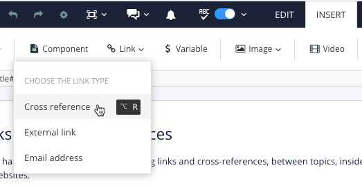

    2.  Then either browse or search for the target topic:

        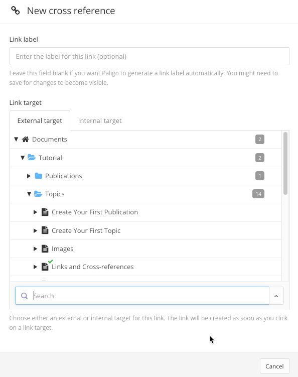

    3.  And then click the topic to insert it to make a cross-reference
        like this:

        See [The (Not Quite) Elementary
        Basics](#UUID-bc844e6e-3bdf-1f9f-dabb-cf1ef3381d7f)

        > [!NOTE]
        > Note that the title is automatically inserted. If you just
        > want to refer to the title you do not have to enter anything
        > in the Link label field.

2.  For a cross-reference to an element in the same topic, do this:

    1.  Choose Cross reference again, just like above.

    2.  But this time, choose the tab Internal target instead:

        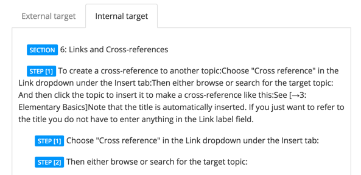

        Paligo will automatically show you all elements that are valid
        to reference. 

    3.  Again, just click the target to insert the reference. Initially
        it will just show the id, save to get the link text to show you
        what it links to. This link shows a sample linking to the
        previous step:

        See [step_title](#UUID-9e6dd53f-8bbd-1c01-4e69-3606fd2d70d0_N1488637713831)

3.  To create a link to an external web site or the like, do this:

    1.  Choose External website in the dropdown.

    2.  Enter a link label and a website url to create a link like this:

        See [Google](http://www.google.com)

        When you publish only the link label will show.

# Tables

You can create many types of tables in the Paligo editor. Tables can
also easily be used inside steps and lists (which can sometimes be
tricky in certain tools), and wherever they are valid.

1.  To insert a table, just use Insert \> Table in the toolbar. Or use
    the keyboard shortcut Alt+Shift+A

2.  Choose whether to have a title or not (you can always change that
    later), and then the number of columns and rows.

3.  Also set whether you want borders and rules. To have all borders and
    rules for all cells, select this:

    

    Should you want no borders or rules, just choose void and none
    instead. There are many other options, but we won't go into that
    now.

4.  Click insert, and you are done, and can now edit your table using
    the familiar tab key to move between cells.

**Merging and splitting cells**

You can create more complex tables by merging and splitting table cells.
Here's a sample table. Try out some of these commands to create a more
complex table:

1.  To merge cells, hold down the Shift key, and then select two or more
    cells.

2.  Then right-click and select Merge cells, or use the keyboard
    shortcut Alt+M.

3.  Then do the opposite, place the cursor in a merged cell, and
    right-click and select Split cell, or use the keyboard shortcut
    Alt+Shift+M.

| Header | Header | Header |
|--------|--------|--------|
| Text   | Text   | Text   |
| Text   | Text   | Text   |
| Text   | Text   | Text   |

Sample Table

# Reusing Content

Now we're getting to the core of Paligo, of course. Reusing content and
single-sourcing is what it's all about after all, right?

Check out the following topics for some of the basics!

## Reusing Topics

This is the most efficient way of reuse, and is what topic-based
authoring is all about. Basically, just break down the content into
small topics and reuse them wherever they are applicable.

1.  Create a new publication, clicking the context menu and selecting
    Create content.

2.  Name it Paligo Quick Guide.

3.  Open the new publication in the Structure View.

    

4.  Drag and drop just some of the basic topics to this new publication,
    like "Create Your First Topic", "Create Your First Publication" and
    "Publishing".

*That's it.* You should now have something like the following, and you
have reused the same topics for a new publication variant. You can do
the same for different products reusing the same content, different
markets, whatever your variants are that you need to reuse content for.

| Getting Started with Paligo | Paligo Quick Guide |
|----|----|
|  | 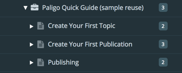 |

You could for instance have a number of different products, say
automobile models A, B, and C, with lots of common content. You would
just reuse the topics that are the same for all product models, and use
unique ones where they differ. (There are more techniques to reuse
topics even if they are different, but you'll learn about those later).

## Reusing Text and Components

Even if one of the most efficient types of reuse in Paligo is the reuse
of entire topics in Publications, as already covered, you also have a
number of techniques at your disposal to make a single topic more
reusable, as well as reuse content within the topic.

**Text fragment reuse**

This is a very powerful feature in Paligo. You can simply copy any
element, using the Paligo "Copy and Paste as Reuse" commands:

*Try this now*:

1.  Copy an element, using the special "Copy element" command, Alt+C.
    For instance, just copy the paragraph above.

2.  Then place the cursor anywhere where a paragraph would be valid, and
    then use the "Paste as reuse" command, Alt+Shift+V.

The text fragment copied will be reused, so you can update it in one
place (any place where it's reused), and have it updated everywhere.
You'll see that it's reused by the link icon. This very paragraph is an
example of this!

The text fragment copied will be reused, so you can update it in one
place (any place where it's reused), and have it updated everywhere.
You'll see that it's reused by the link icon. This very paragraph is an
example of this!

You can also reuse text fragments like this from one topic to another of
course. Just open another topic in a separate tab by Ctrl/Cmd-clicking
it, and then do the same thing.

> [!NOTE]
> You'll notice that if you try to edit the reused text, you can't. This
> is by design, so that you do not accidentally just change a reused
> text fragment. But if you know a change needs to be made in all the
> places it's reused, you can unlock it:
>
> 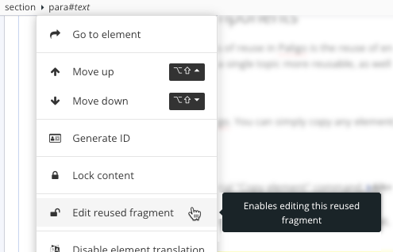
>
> And if you need to check where it's reused to determine if it can be
> changed, just select to see its Usage information:
>
> 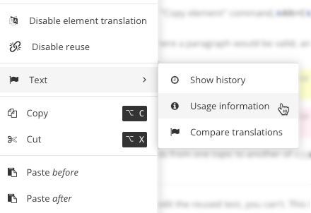

**Topic-in-topic reuse**

You can reuse a topic within another topic. One of the most common uses
for this is the reuse of admonitions (notes, warnings, etc) - i.e
specialized topic types. Here's a note as a separate component, reused
here:

> [!NOTE]
> Note that notes and other topic types can be reused within other
> topics.
>
> This is an example of that.

Try it out for yourself! Just select the Insert tab, and then reuse a
Component:

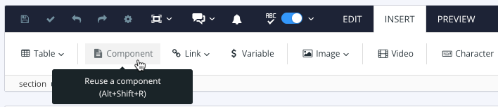

In the dialog, just select the topic you want to reuse inside the
current topic. It can be any regular topic, or a specialized topic like
warnings, etc.

> [!NOTE]
> Note that you need to have the cursor in a valid place for the
> component reused. For example, if you insert a warning, it needs to be
> in a place where a warning is valid, in a section, a step, etc.

**See also**

Another very powerful technique for reuse is filtering, see more about
this in [Variant Filtering](#UUID-80a86cf8-772a-6af1-f203-49f939340b14).

## Variant Filtering

There are many names referring to the same concept: *Filtering*,
*Profiling*, *Conditional text*, *Applicability*, etc.

But it all has to do with the same thing: marking up some parts of the
text to exclude or include it in the final published output, in order to
create variants of the same single source of content.

Let's try it. So let's say you have content for which you need to create
variants for different audiences. For this we use the audience
attribute:

Example of filtered procedure steps

1.  Select the folder, right-click, and select Compress.

2.  Repeat for each folder.

3.  In the terminal, run this command from the parent
    folder: `for i in */; do zip -r "${i%/}.zip" "$i"; done`.

> [!TIP]
> Place the cursor at the filter (funnel) icon
> , and check the
> filter attribute on the right in the Element attributes panel. You'll
> see that the first step is filtered for Beginners, as is the second.
> The third step is filtered for Experts.

What this means is that when you publish, you'll select what variant to
publish to, Beginner or Expert. If you select to publish for Beginners,
only step 1 and 2 will be shown. If you select to publish for Experts,
only one step will appear (the third one above).

You can read more about filtering here: [Filtering
Content](http://help.paligo.net/en/authoring-in-paligo/filtering-content.html).

# The (Not Quite) Elementary Basics

Ok, bad pun intended... ;-) 

Even though Paligo is made to make it as easy as possible, there are a
few things that are useful to get the hang of initially to work with
structured authoring and XML.

But it's a short learning curve, and well worth it to achieve the
efficiency, quality, reuse of content, and savings in the long run. So
stick with it, and very soon you'll be so used to it it's second nature,
and you'll start to see that you can actually author faster than you did
in any other environment.

> [!NOTE]
> Part of this topic is a bit theoretical, and if you prefer to just
> dive in and start writing topics or fiddle with some of the example
> topics, feel free to do so, you can always come back to this!
>
> However, the first part about "Creating Elements" will be very useful
> to check out even if you're eager to get going!

Just like topics are the building blocks of the entire publication (like
sections), elements are the smallest building blocks making up those
topics.

The elements are "XML" elements (similar to HTML, but much more
powerful). You don't have to learn XML to use Paligo, but a few basics
about the element structure that make up Structured Authoring can be
good to at least get a taste of.

There are many ways to work with content using elements in Paligo:

Creating Elements

1.  The easiest way to create elements is perhaps the toolbar, where
    many of the common elements are found. Just put the cursor where you
    want it and click the icon for what you need, like a list or a
    paragraph:

    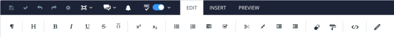

2.  Often, when you just need a new paragraph when you are already in
    one, just hit Enter to get another paragraph. This actually creates
    a new para element, but it feels the same as it would in any word
    processor.

3.  You also have keyboard shortcuts for many of them. For instance, to
    create a note, just hit Alt+Shift+N. You'll find the full list in
    the online help.

4.  Last, but definitely not least, you have the Element Context Menu.
    Just hit Alt+Enter.This will give you each and every element
    available. Quite a long list, but you can easily narrow it down by
    starting to type the name of the element.

    

There are "block" elements and "inline" elements:

**Block Elements**

Block elements are elements that take up vertical space on a page, for
instance a paragraph. Other block elements are tables, figures,
procedures, lists, examples, etc. Here are some examples:

The para (for paragraph) element is a block element. This is a para.

| Header             | Header             |
|--------------------|--------------------|
| Text in first row  | Text in first row  |
| Text in second row | Text in second row |

A sample table. This is a block element.

<figure>

<figcaption>An example figure</figcaption>
</figure>

- First

- Second

- Third

> [!NOTE]
> And finally, besides this note being a block element, notice also that
> all of these examples are in an...example. (In this case to be more
> exact, an informalexample)
>
> This is a block element too, and it shows that one block element can
> be nested (wrapped) in another block element.

**Inline Elements**

Inline elements are the type of elements that only occur in line with
running text, like bold, italic, footnote symbols, etc. Here are some
examples:

You an use all the familiar inline formatting elements, like **bold**,
*italic*, <u>underline</u>. While you can create the elements using the
Element Context menu, it is of course easier to just use keyboard
shortcuts, just the same ones you're probably familiar with.

You can also use shortcuts to create some specialized inline elements
like guilabel - to indicate something that is part of a user interface.
Use Alt+G for that. BTW, the keyboard shortcuts were tagged too, as you
can see, with the keycap inline element. 

By tagging for instance software gui terms with the keycap element
instead of just bold or italic or whatever, you can have full control to
change the appearance of all those terms at any time. Like having it
come out like this: .
The example to show this is by the way another inline element - an
inlineimage, used for small images like icons. And so was the mention of
the element name - a tag element.

Just put your cursor in any of the inline elements, and you'll see it in
the Structure Menu:

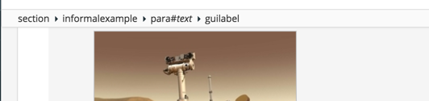

