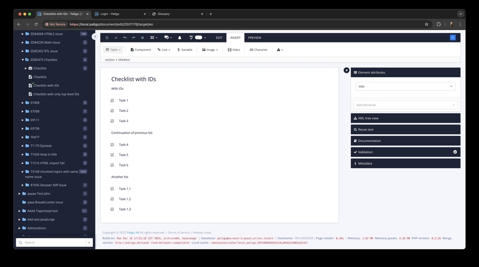

# Using Images and Videos in DocBook

**Basic Image**

**Image with Caption and role img-thumbnail**

DocBook supports various ways to include images and videos for
documentation.

**Multiple Formats for Images**

The simplest way to include an image:

<figure>

<figcaption>Screenshot of Application UI</figcaption>
</figure>

<figure>
<table>
<tbody>
<tr>
<td>

</td>
<td></td>
</tr>
</tbody>
</table>
</figure>

Side by side images

**Linked Image**

Clicking on the image opens a larger version:

**Externally Linked Video**

Inline image  

Linking to a video hosted online:

Click to view full-size image.

Flowchart diagram showing the process.

An example image demonstrating a feature.
