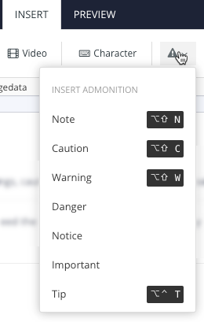
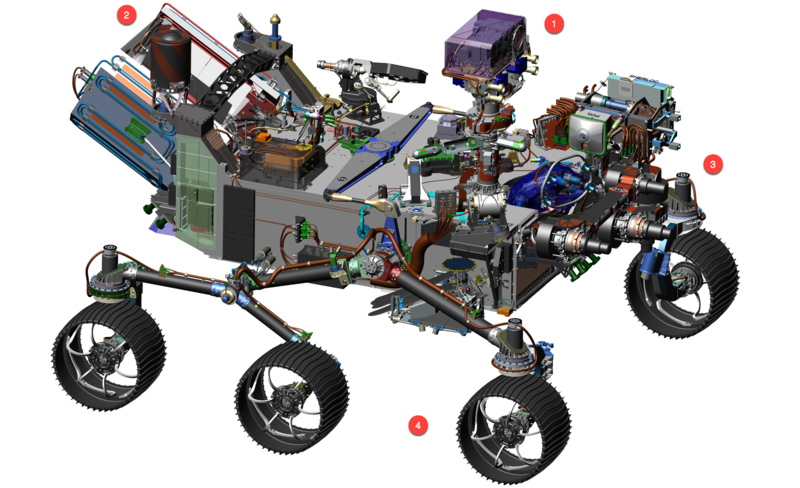

# different images

**Inline image:** 

**Image:**

**Figure:**

<figure id="figure-id13162494988189">

<figcaption>title for figure</figcaption>
</figure>

<figure>

<table>
<tbody>
<tr>
<td>

</td>
<td>

</td>
</tr>
</tbody>
</table>
<figcaption>some caption for both</figcaption>
</figure>
